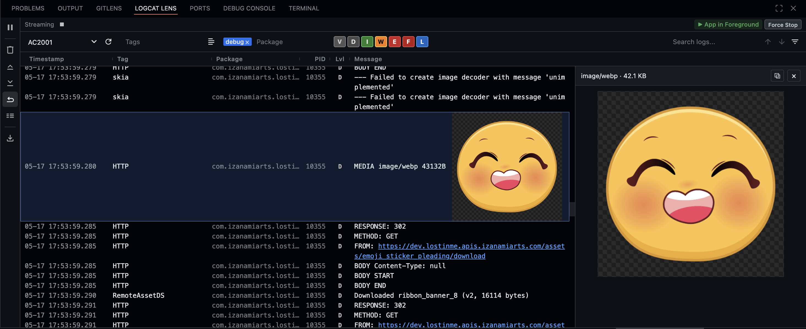

# Logcat Lens

A powerful Android Logcat viewer for VS Code — stream, filter, and search device logs without leaving your editor.


## Features

- **Real-time streaming** — Stream logs from any connected device or emulator
- **Instant filtering** — Toggle log levels, add tag/package filters with autocomplete
- **Search** — Full-text search with match counter, navigation, and filter mode
- **Display modes** — Standard, compact, and soft wrap with infinite scroll-back
- **High performance** — Smooth scrolling even with massive log volumes
- **Export & copy** — Double-click to copy, export filtered logs to editor
- **App lifecycle tracking** — Real-time app state (Foreground, Background, Killed, Crashed, ANR) with action buttons
- **Tag groups** — Save and load named groups of tags for quick switching
- **Device monitoring** — Auto-detect device connect/disconnect with online/offline status
- **Detail pane** — Click any log row to open a resizable side pane with full message, multi-line JSON auto-stitched and pretty-printed across chunked log entries
- **Inline media previews** — Image / audio / video responses logged as base64 are detected automatically (PNG, JPEG, GIF, WebP, BMP, MP3, WAV, OGG, MP4, PDF…) and rendered inline in the log row; click for full-size preview in the detail pane
- **Clickable URLs** — HTTP/HTTPS links in messages open in your system browser




## Inline Media Previews

Any log line whose embedded base64 starts with a known media magic header is rendered as the actual image (or `<audio>` / `<video>`) right in the log row — no need to copy bytes out, decode them, and open them in another tool. Click the preview to expand it in the detail pane.

The viewer is fully app-agnostic — there is no special tag, prefix, or marker required. From your app, anywhere you can write:

```kotlin
Log.d("HTTP", Base64.encode(imageBytes).decodeToString())
```

…Logcat Lens will recognise the bytes by their magic header and show the preview.

**Limitations** (these are device-side, not viewer-side):

- Android's `Log.d` truncates a single record at ~4 KB. For media bodies larger than that, the app must split the base64 into ~3.5 KB chunks before logging — Logcat Lens reassembles the chunks automatically. A single oversized `Log.d` call loses its tail on the device.
- Under heavy concurrent volume (e.g. an asset gallery downloading 100+ images at once) Android's logd can drop records from its ring buffer. Gaps in the base64 will produce a broken-image render.
- HTTP logging interceptors that read the body as a UTF-8 string (`readUtf8()` / `bodyAsString()`) corrupt binary bytes *before* they reach `Log.d` — no viewer can recover that. For media, capture the raw bytes via `peekBody`/an OkHttp interceptor and log them as base64.
- For serious HTTP body inspection, pair Logcat Lens with an in-app inspector like Chucker or Axer. Logcat Lens is best for *seeing* media inline with the rest of your logs, not as a replacement for a dedicated HTTP inspector.

## Requirements

- **ADB** (Android Debug Bridge) — the extension will auto-detect it from common locations, or you can install it directly from within VS Code. **Android Studio is not required.**
- A connected Android device or emulator

### ADB Not Found?

If ADB is not installed, Logcat Lens will prompt you to install it with a single click — no Android Studio needed.


You can also set a custom ADB path in **Settings > Logcat Lens > Adb Path**.

## Usage

1. Open the **Logcat Lens** tab in the bottom panel
2. Select a device and click play to start streaming
3. Filter by level, tag, or package using the filter bar
4. Use sidebar buttons to pause, clear, wrap, or export
5. Select a single package to enable lifecycle tracking and app actions
6. Save frequently-used tag sets as groups for quick recall

## Contributing

Found a bug or have a feature request? [Open an issue](https://github.com/AshishKumarD/logcat-lens/issues).

Want to contribute? [Submit a pull request](https://github.com/AshishKumarD/logcat-lens/pulls) — all contributions are welcome!
