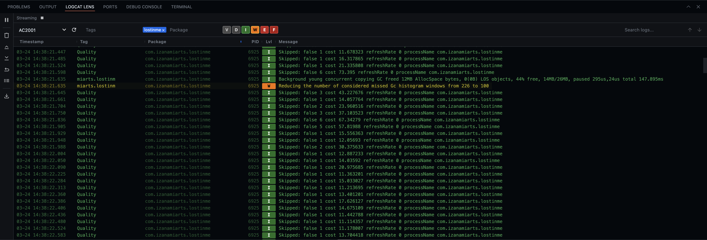
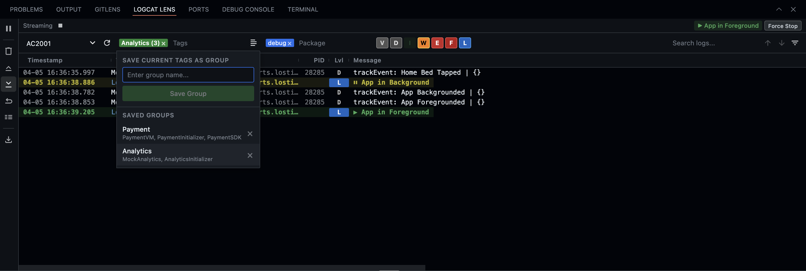
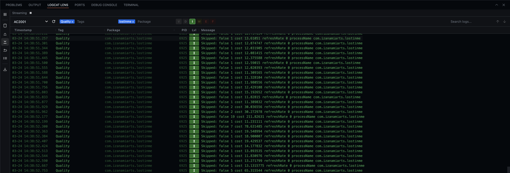
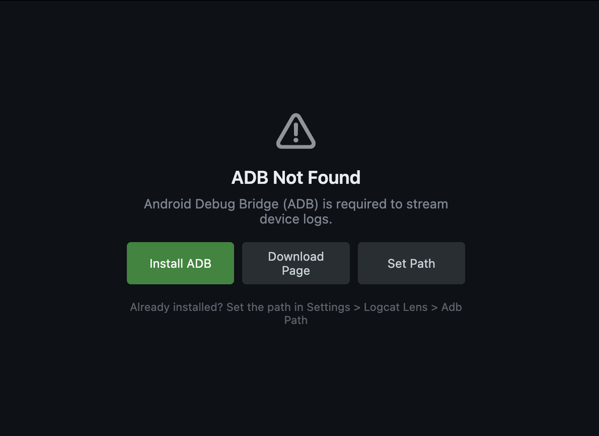

# Logcat Lens

A powerful Android Logcat viewer for VS Code — stream, filter, and search device logs without leaving your editor.

## Features

- **Real-time streaming** — Stream logs from any connected device or emulator
- **Instant filtering** — Toggle log levels, add tag/package filters with autocomplete
- **Search** — Full-text search with match counter, navigation, and filter mode
- **Display modes** — Standard, compact, and soft wrap with infinite scroll-back
- **High performance** — Smooth scrolling even with massive log volumes
- **Export & copy** — Double-click to copy, export filtered logs to editor
- **App lifecycle tracking** — Real-time app state (Foreground, Background, Killed, Crashed, ANR) with action buttons
- **Tag groups** — Save and load named groups of tags for quick switching
- **Device monitoring** — Auto-detect device connect/disconnect with online/offline status

## Requirements

- **ADB** (Android Debug Bridge) — the extension will auto-detect it from common locations, or you can install it directly from within VS Code. **Android Studio is not required.**
- A connected Android device or emulator

### ADB Not Found?

If ADB is not installed, Logcat Lens will prompt you to install it with a single click — no Android Studio needed.

You can also set a custom ADB path in **Settings > Logcat Lens > Adb Path**.

## Usage

1. Open the **Logcat Lens** tab in the bottom panel
2. Select a device and click play to start streaming
3. Filter by level, tag, or package using the filter bar
4. Use sidebar buttons to pause, clear, wrap, or export
5. Select a single package to enable lifecycle tracking and app actions
6. Save frequently-used tag sets as groups for quick recall

## Contributing

Found a bug or have a feature request? [Open an issue](https://github.com/AshishKumarD/logcat-lens/issues).

Want to contribute? [Submit a pull request](https://github.com/AshishKumarD/logcat-lens/pulls) — all contributions are welcome!
